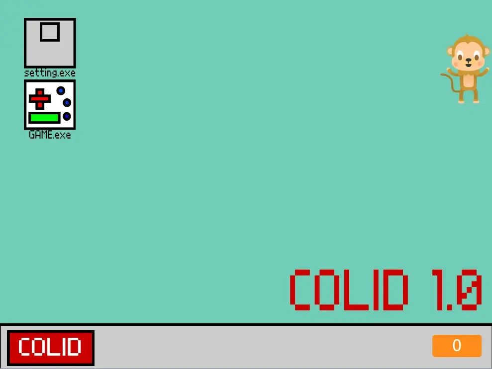
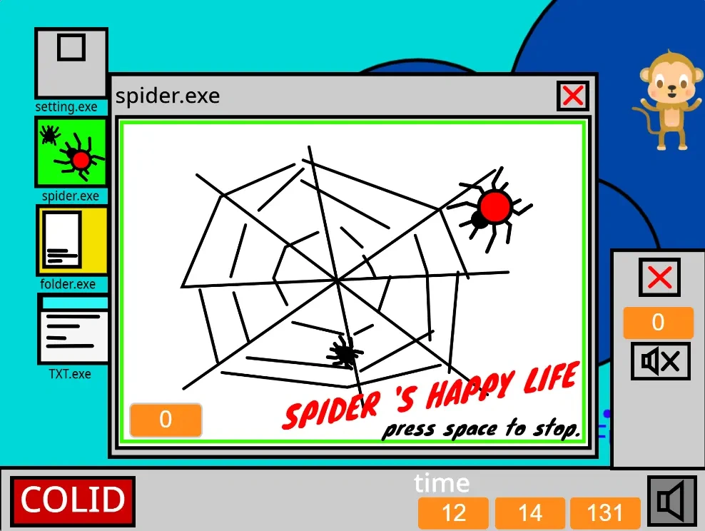
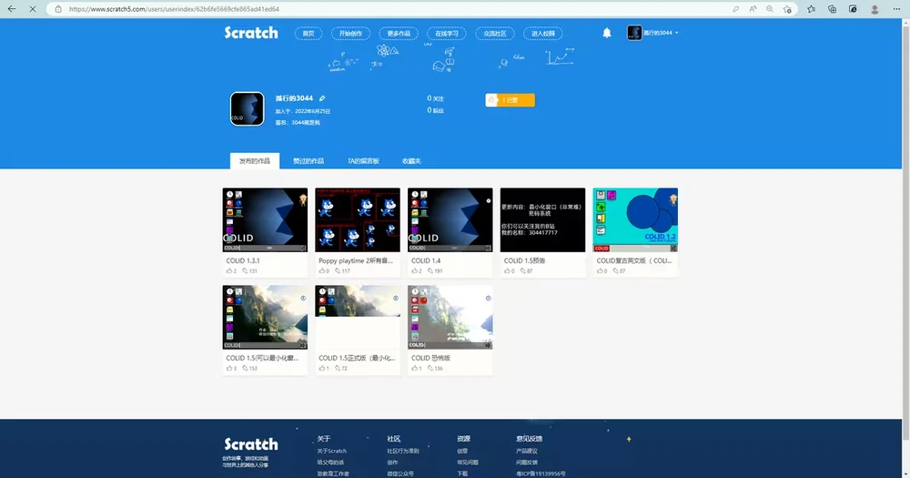
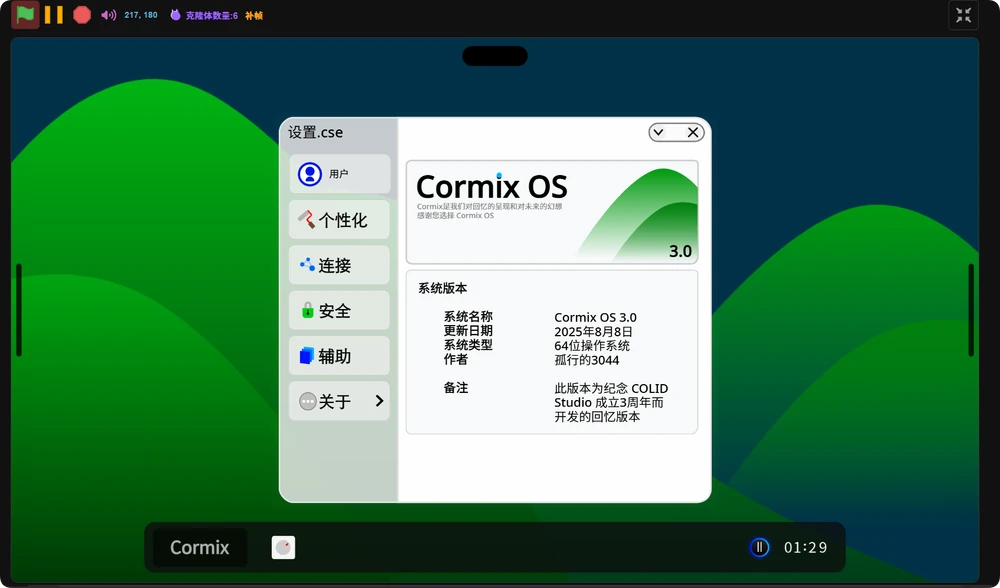

# COLID Studio

## COLID 的评价

> 我认为3044所创办的工作室是一个较为优秀的工作室，他用不同的风格创造出了不一样的系统，在圈内他不一定是最好的那一个，但是他一定是最爱失踪的人（这段划掉），用他的话来说就是：”也许这一切微不足道，不畏艰难，定有曙光。“
>
> ——————SWEEP

## 关于COLID Studio

是UP主 **`@孤行的3044**`** 所创立的小型工作室，BiliBili 小有名气。COLID 虽然不是英语单词，但是它是五个单词的结合。C：Creative 创造性的；O：Opened 开放的；L：Local 本地化的；I: Intelligent智慧的；D：Dreamful 梦想的。这是工作室的核心目标。

最成功的作品是由 Scratch 开发的 `COLID OS` 系列，颇受赞扬与支持。COLID OS 有自己的创新部分，能够在众多 Scratch 系统里做到独特与优秀。还有其他衍生产物。`COLID Pad OS`，动画流畅，稳定好用，适合移动端设备；`Cormix OS`，年轻化、多彩化，更适合生活场景和娱乐场景的轻度“操作系统”。这也是 COLID Studio 更新最多的系列，是目前工作室的工作重点。

除此之外，也有“林檎手机系列”，将林檎文化与数码文化相结合，再加入自己的设计语言而创造的产品，在 Bilibili 曾获得将近 9 万的播放量，截止到 2024 年末，也没有一个视频超过它。

之后，我们计划使用 COLID OS 拓展程序内核，模仿各大热门小游戏，制作属于我们的 COLID Game。除此以外，我们还计划开发出兼容多种类型游戏类型的 COLID Entertainment Engine（COLID 游戏引擎）。7月末，我们已经发布了使用 COLID Entertainment Engine 开发的恐怖游戏《大香蕉之夜》，目前来说内核比较稳定。

在哔哩哔哩的关注数已达 1417 粉目前共发布了 73 个视频

## 关于起源

COLID OS，一个你也许从来没有听过的系统，这个在 Scratch 中社上几乎都找不到的系统就是我的杰作。你也许不知道为什么我把系统叫做 COLID OS，实际上，他的意思是由五个单词组成而来的：

- **`C-Creative`，即具有创造性的，意思是要创造过去从来没有的设计。**

- **`O-open`，即开源的，我几乎所有的系统都开源了（除了测试版）。**

- **`L-local`，即本地化的，要做到很符合中国人的审美。**

- **`I-intelligent`，即智慧的，省掉那些看起来多余的步骤，简洁明了。**

- **`D-Dreamful`，即梦想的，这正是我所追求的。**

就是由这简单的五个形容词组成的词语，为现在的我指明了前进的方向。

那是一个并不能出去游玩的春天，上海在4月到6月一直封控。在这无趣的房子里。我打开已经两年没玩的 Scratch。记得上一次编程还是在我四年级的时候。

还是熟悉的界面，还是熟悉的小橘猫，我现在仍然热爱着他。创造出我想要的程序是我所追求的。现在的电脑操作系统，除了 Windows 就是 Mac OS，前者样式太单一，后者界面难看我不喜欢。我觉得，看着顺心才能使人心情舒畅，为什么不自己做系统呢？灵感说来就来。

我的第一版系统是这个：`COLID test 0001`

由于模仿的是 Windows 95，所以看起来很复古（甚至离普谱）。

你问我为什么是英文？我用的是其他电脑编辑的，这个烦人的输入法总是给我调成五笔输入，很不习惯，所以就只好用英文了。这个页面的英文翻译过来就是：

“这个系统在 1998 年开发，这是 COLID 的最初版本（这里的 PLOSE 是原来的代号）。如果你有任何的问题，请拨打电话********，我们会升级操作系统。（OS，全称叫 `Operating system`，即操作系统）”

几天后就发布了 `COLID 1.0`。1.0除了动画其他都没怎么变

但是，他添加了一个我在 11 月 26 日发布的一个视频中提到过的——桌宠。没错！就是这个不起眼的小家伙。但是这个版本的很笨。

又过了几天，`COLID 1.0.4` 发布，增加了声音。`COLID 1.0.5` 添加了时间，但是是我自己做的时间，非常不准。

到了5月初，`COLID 1.1` 正式发布了。一天后又更新了 `COLID 1.1.1` 补丁。

新版本添加了文件夹和 TXT 程序（说句实话叫复读机）；更新了小游戏的剧情，写了一只蜘蛛吃虫子的故事（实属瞎扯）。但是有太多 BUG 了，下面的秒数直接超过了 60，这就离谱。而且很多程序也并没有完成，像画板程序，直到 1.5 的时候才准备删除，1.6 直接不要了。

开发完 1.1.1 时，我加入了一个小的社区，现在也不怎么在那上面发布了。那是我还没有中社账号。

建议不要进去，我花了好长时间才搞定，可能已经没多少服务器了。我也把账号注销了。在这个网站上，又掀起了一波浪潮。

今天先回忆到这里吧。下一期会讲关于我在社区的一些事。

## 关于产品

### `COLID OS`

COLID OS 是 COLID Studio 目前最有名的项目，您大部分都是可能认识这个项目而来的，目前（截至2025|8|17 00：46）COLID OS 已经更新至 2.4.1 版本

COLID OS 一直都是 CS（COLID Studio 简称）的得力项目，在早期版本类似 Windows95 的老系统，之后画风和 UI 不断升级，在 2.0 中提出了轻拟物风格，从实际观感来看，这种风格虽然小众但是却是无一无二的，这种精致而简洁的风格在 SCOS 也是独具一帜的

#### 时事

在 COLID OS2.4.1 中，图标风格首次换成了扁平风格，这是 CS 的一次尝试

#### 琐事

在新版 COLID OS，系统体积被压缩至650kb _（这在圈内来说，真的是很小了（可能））_

2.2 版本，这是CS首次bug最多的系统{外号：“bug小王子”（Windows ME：瞧啊瞧啊，这是谁来了）}

> （虽然身为 CS 一员，但是这种客观事实我们没法雪藏（我们也没想过雪藏（￣︶￣）））

在很多版本都有彩蛋（当然我不会告诉你咋找 (￣ ‘i ￣;) ）

COLID OS 有一个防火墙（COLID Safety）这是由 SWEEP 提出的，他早年作品（23年）kittenOS 被病毒入侵，这是非常懊恼的一件事。

#### Cormix OS

Cormix OS 是 CS 的第二大操作系统，早期目标是制作类似 Windows7 一样的 Aero 风格，但是在技术上的原因，这一目标并没实现，之后由于将注意力放在 COLID OS 上，Cormix OS 并没怎么继续更新。在 2025 暑假，Cormix OS 迎来最大的一次更新，这次的目标变成了将COLID OS 淘汰掉的废案安排在它身上，这看似有点不太好（实际上我也不知道怎么说；）），但是又何尝不是另一种起点，这意味着大家的意见不一定会被排除。

##### 在3.0的一些新发现

1. 这是 COLID Studio3 周年之作（牛魔都知道好不好）

2. 在 3.0 中，添加了一些功能（实际上来自 “bug小王子” 2.2）

3. 鼠标指针（由SWEEP提出）

4. 全屏化（3044提出）

这些将做为CS新的起点，也预示未来版本会动画与实用更加注重

> （当然这不是说了的－O－）

##### 琐事(2)

没事(*￣3￣)╭

（骗你的）

很显然文件体积很小（自己下载去看好吧）

#### Arc OS

Arc OS 是 CS 的移动端系统，但显然这并非 CS 在移动领域的第一次尝试，最早可以追溯至`2023-02-04 07:00:00`。

Arc OS 主打动画和丝滑，它将成为 CS 在动画的主力，现已更新 4.2。

##### 琐事(3)

我还真憋不出来( ´･･)ﾉ(._.`)

#### TV OS

是最近发布的系统，发布于 2025-08-16 21:41:24（666，3044 盐都不盐了，一口四川话骇死人）

目前仅仅是发布，还没有进行上新

这是发布会截图

##### 琐事(4)

这个系统有拍照）

而且我们 CS 自己人都还没用上（

这个系统的提议是 SWEEP（合着我是灵感菇了(￣_,￣ )）

#### 声明

**3044 从来不会在没授权的情况下允许把 COLID OS 的系统文件二次分发以及二次创作，COLID OS 虽然是开源作品，但是我们绝对零容忍这种随意搬运作品的人，他们从来不会知道开发一个系统内核要多久，这些人只需要一个 ctrl+c 和 v 就完成了他们的”作品“，这是绝对不会被怜悯的，至于 COLID OS 的定制版，只要不是照抄都是在忍耐范围** （他们往往会标注是 3044 原创，好比某些厚脸皮的人）的

> ————SWEEP
> 注：选择合适的开源协议十分重要

#### 其他琐事

3044 经常失踪（）

群员经常抽像（尤其有一个打 kards 的（其实就是我））

COLID 的发布会可能是较为新颖的——在 MC 开发布会是狠人（管理层各个是狠人）

COLID Studio 的管理层
（虽然这里不是官网，但还是有必要提一嘴）

{标准：群内管理员，若无特殊情况或3044本人指正}

{这里不会具体指出职位，只是大概表明，但并不代表就不是一致的}

- **孤行的 3044** `【室长】`（神秘失踪入）（摄表：真主）

- **SWEEP** `【副室长】`（灵感古里古里古里我擦灵感菇）（神秘谜语人）

- **Cat** `【美工组组长+宣传组组长】`（疑似是战雷玩家）（元老骨灰级人物）

- **焦糖蛋黄** `【没有组】`（疑似永久失踪）

- **Cyberexplorer** `【开发组】`（全群唯一的猫）

## 友情链接

【COLID Stuio】QQ：[996349521](https://qm.qq.com/q/ZqIzTRow4o)

【COLID开发者一群】QQ：[1017738164](https://qm.qq.com/q/Dmr225iauk)

【COLID官方QQ频道】：pd41344914

[【COLID 哔哩哔哩】](https://space.bilibili.com/1825564224/upload/video)

[【抖音】](https://www.douyin.com/user/MS4wLjABAAAAs-utXqZN9ZM9lNHYauoSBPYcfbzNDIlkMZZQzRx9CXk?from_tab_name=main)

[【官网】](https://colid.mysxl.cn/)

--------

## 参考资料

- [孤行的3044投稿视频-孤行的3044视频分享-哔哩哔哩视频](https://space.bilibili.com/1825564224/upload/video)

- [COLID 官网](https://colid.mysxl.cn/)

- [用Scratch制作的电视系统？十分巴适的切换动画😘_哔哩哔哩_bilibili](https://www.bilibili.com/video/BV1kFYBzkEeQ/?spm_id_from=333.1387.upload.video_card.click)

- [【我用Scratch做系统】COLID OS的诞生 - 哔哩哔哩](https://www.bilibili.com/opus/736466031053111298?spm_id_from=333.1387.0.0)

- [文集详情-哔哩哔哩专栏](https://www.bilibili.com/read/readlist/rl646139?spm_id_from=333.1369.opus.module_collection.click)
